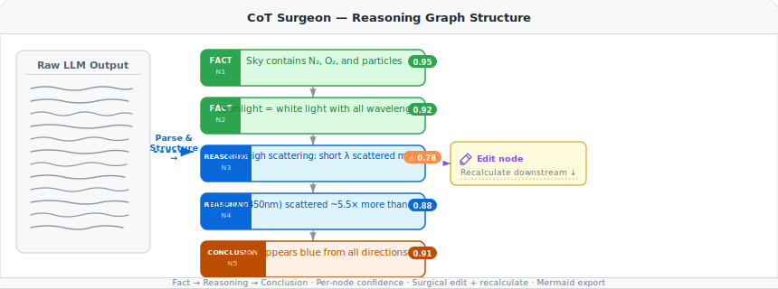
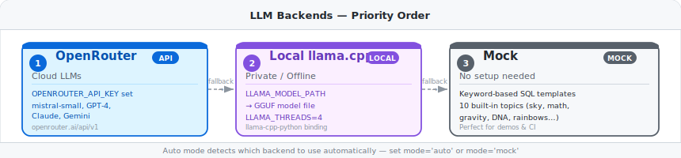

# CoT Surgeon — Structured Reasoning Editor for LLM Chains

> *Made autonomously using [NEO](https://heyneo.so) · [](https://marketplace.visualstudio.com/items?itemName=NeoResearchInc.heyneo)*


**Parse any LLM's chain-of-thought into an editable graph — find weak reasoning steps, surgically fix them, and recalculate downstream conclusions.**

CoT Surgeon takes the unstructured prose that a language model produces during chain-of-thought reasoning and converts it into a typed, queryable graph of **FACT**, **REASONING**, and **CONCLUSION** nodes. Each node carries a confidence score. You can inspect the graph, patch any node, and trigger automatic recalculation of everything downstream — without re-running the full prompt.

---

## How it works



The pipeline has three phases:

1. **Parse** — the engine calls your chosen LLM backend (or the built-in mock) and instructs it to emit its chain-of-thought in a structured format with explicit node boundaries and confidence estimates.
2. **Structure** — the raw response is parsed into a `ReasoningGraph`: a directed acyclic graph where each node is typed (`FACT`, `REASONING`, or `CONCLUSION`) and carries metadata such as confidence, edit history, and optional alternative branches.
3. **Edit** — you can surgically modify any node with `update_node()`, then call `recalculate_from_node()` to regenerate every node that depends on the edited one, leaving upstream context intact.

---

## Install

```bash
git clone https://github.com/your-org/cot-surgeon.git
cd cot-surgeon
pip install -r requirements.txt
```

For the Streamlit web UI:

```bash
pip install streamlit
```

For local llama.cpp inference:

```bash
pip install llama-cpp-python
```

---

## Quickstart

```python
from cot_surgeon import ReasoningEngine, ReasoningGraph, ReasoningNode, NodeType

# No API key needed — mock mode uses built-in templates
engine = ReasoningEngine(mode="mock")

graph = engine.generate_cot("Why is the sky blue?")

# Inspect the conclusion
print(graph.get_conclusion())

# Graph-level stats
print(graph.stats())
# {
#   "version": 1, "edit_count": 0, "avg_confidence": 0.89,
#   "low_confidence_count": 0, "node_count": 5, ...
# }

# Find nodes with confidence below threshold
weak = graph.low_confidence_nodes(threshold=0.8)
for node in weak:
    print(f"{node.id}  [{node.node_type.name}]  conf={node.confidence:.2f}")

# Surgically edit a node
graph.update_node("node_3", "Rayleigh scattering causes shorter wavelengths to scatter more strongly.")

# Regenerate everything downstream from the edited node
graph = engine.recalculate_from_node(graph, "node_3")

# Undo the last change
if graph.can_undo():
    graph.undo()

# Export to Mermaid diagram
mermaid = graph.to_mermaid()
print(mermaid)

# Serialize to dict / JSON
data = graph.to_dict()
```

---

## Web UI

```bash
streamlit run app.py
```

The Streamlit interface exposes two tabs:

| Tab | Description |
|-----|-------------|
| **Single Analysis** | Enter a prompt, generate a reasoning graph, inspect nodes, edit content, trigger recalculation, and export Mermaid |
| **Batch Compare** | Run multiple prompts at once and compare their graphs side-by-side — useful for regression testing prompt changes |

---

## LLM Backends



CoT Surgeon supports three backends selected in priority order when `mode="auto"`:

| Priority | Backend | When active | Key setting |
|----------|---------|-------------|-------------|
| 1 | **OpenRouter** | `OPENROUTER_API_KEY` is set | `OPENROUTER_MODEL` |
| 2 | **Local llama.cpp** | `LLAMA_MODEL_PATH` is set | `LLAMA_MODEL_PATH` |
| 3 | **Mock** | Always available (fallback) | — |

Pass `mode` explicitly to override auto-detection:

```python
engine = ReasoningEngine(mode="openrouter")   # cloud
engine = ReasoningEngine(mode="local")        # llama.cpp GGUF
engine = ReasoningEngine(mode="mock")         # no API key needed
engine = ReasoningEngine(mode="auto")         # detect automatically
```

---

## Node Types

| Type | Color | Role | Example content |
|------|-------|------|-----------------|
| `FACT` | Green | Grounded, verifiable premise | "The atmosphere contains N₂, O₂, and suspended particles" |
| `REASONING` | Blue | Inferential step derived from facts | "Rayleigh scattering causes shorter wavelengths to scatter more" |
| `CONCLUSION` | Orange | Final answer derived from reasoning chain | "The sky appears blue when viewed from any direction" |

Edited nodes are rendered in **purple** in Mermaid exports so you can see which parts of a graph have been modified.

Access a node's type programmatically:

```python
from cot_surgeon import NodeType

for node in graph.nodes.values():
    if node.node_type == NodeType.REASONING:
        print(node.id, node.confidence)
```

---

## Edit & Recalculate

The surgical edit workflow lets you fix a single flawed step without re-running the entire prompt:

```python
# 1. Inspect the graph to find the node you want to fix
for node_id, node in graph.nodes.items():
    print(f"{node_id}  {node.node_type.name:12s}  conf={node.confidence:.2f}  {node.content[:60]}")

# 2. Edit the node in-place
graph.update_node("node_3", "Corrected reasoning about Rayleigh scattering.")

# 3. Recalculate all downstream nodes
#    Nodes that do NOT depend on node_3 are untouched.
graph = engine.recalculate_from_node(graph, "node_3")

# 4. The graph version counter increments on every edit
print(graph.version)     # 2
print(graph.edit_count)  # 1
```

---

## Undo History

Every mutating operation (edit, recalculate) pushes a snapshot onto an internal history stack. You can step back through up to 20 versions by default.

```python
# Take an explicit snapshot before a risky change
graph.snapshot()

# Make changes ...
graph.update_node("node_2", "Something experimental")

# Check whether undo is available
if graph.can_undo():
    graph.undo()   # restores previous state

# The stack depth is controlled by MAX_HISTORY (default 20)
```

---

## Confidence Scoring

Each node holds a `confidence` float in the range `0.0–1.0` estimated by the LLM during generation. A score below `CONFIDENCE_THRESHOLD` (default `0.7`) flags the node as low-confidence.

```python
# Find all nodes below a custom threshold
weak_nodes = graph.low_confidence_nodes(threshold=0.75)

for node in weak_nodes:
    print(f"[!]  {node.id}  conf={node.confidence:.2f}  —  {node.content}")

# Global stats
stats = graph.stats()
print("Average confidence:", stats["avg_confidence"])
print("Low-confidence nodes:", stats["low_confidence_count"])
```

Low-confidence nodes are highlighted with a warning indicator in the Streamlit UI and receive a distinct color in Mermaid exports.

---

## Mermaid Export

`graph.to_mermaid()` returns a Mermaid flowchart string with nodes color-coded by type:

```python
mermaid = graph.to_mermaid()
print(mermaid)
```

Example output:

```
graph TD
    node_1["Sky contains N2, O2, and particles\n(conf: 0.95)"]:::factNode
    node_2["Sunlight = white light with all wavelengths\n(conf: 0.92)"]:::factNode
    node_3["Rayleigh scattering: short wavelengths scatter more\n(conf: 0.78)"]:::lowConfNode
    node_4["Blue light scattered ~5.5x more than red\n(conf: 0.88)"]:::reasoningNode
    node_5["Sky appears blue from all directions\n(conf: 0.91)"]:::conclusionNode
    node_1 --> node_3
    node_2 --> node_3
    node_3 --> node_4
    node_4 --> node_5

    classDef factNode      fill:#dafbe1,stroke:#2da44e,color:#1a7f37
    classDef reasoningNode fill:#ddf4ff,stroke:#0969da,color:#0550ae
    classDef conclusionNode fill:#fff1e5,stroke:#bc4c00,color:#bc4c00
    classDef lowConfNode   fill:#fff8c5,stroke:#d4a72c,color:#7d4e00
    classDef editedNode    fill:#fbefff,stroke:#8250df,color:#6639ba
```

Paste the output into any Mermaid renderer, a GitHub markdown fence, or Notion.

---

## Batch Analysis

Process multiple prompts in a single call and compare results:

```python
prompts = [
    "Why is the sky blue?",
    "Why does ice float on water?",
    "How does GPS work?",
]

graphs = engine.batch_analyze(prompts)

for prompt, graph in zip(prompts, graphs):
    stats = graph.stats()
    print(
        f"{prompt[:40]:40s}  "
        f"avg_conf={stats['avg_confidence']:.2f}  "
        f"weak={stats['low_confidence_count']}"
    )
```

The **Batch Compare** tab in the Streamlit UI wraps this API with a side-by-side visualization.

---

## Environment Variables

| Variable | Default | Description |
|----------|---------|-------------|
| `OPENROUTER_API_KEY` | — | API key for the OpenRouter cloud backend |
| `OPENROUTER_BASE_URL` | `https://openrouter.ai/api/v1` | OpenRouter endpoint |
| `OPENROUTER_MODEL` | `mistralai/mistral-small-2603` | Model to request via OpenRouter |
| `MAX_TOKENS` | `1024` | Maximum tokens per LLM call |
| `TEMPERATURE` | `0.7` | Sampling temperature |
| `COT_STEPS` | `3` | Reasoning steps to generate (range 2–7) |
| `MAX_RETRIES` | `3` | Retry attempts on LLM failure |
| `RETRY_DELAY` | `1.0` | Initial retry delay in seconds (exponential backoff) |
| `CONFIDENCE_THRESHOLD` | `0.7` | Threshold below which nodes are flagged low-confidence |
| `MAX_HISTORY` | `20` | Maximum undo stack depth |
| `LOCAL_MODE` | `false` | Force the local llama.cpp backend |
| `LLAMA_MODEL_PATH` | — | Path to a `.gguf` model file |
| `LLAMA_CTX_SIZE` | `2048` | llama.cpp context window size |
| `LLAMA_THREADS` | `4` | CPU threads for llama.cpp inference |
| `OUTPUTS_DIR` | `outputs/` | Directory for exported files |
| `STREAMLIT_SERVER_PORT` | `8501` | Streamlit server port |
| `STREAMLIT_SERVER_ADDRESS` | `localhost` | Streamlit bind address |

Set variables in your shell or in a `.env` file at the project root.

---

## Run Tests

```bash
pytest tests/test_reasoning.py -v
```

104 tests cover node creation, graph construction, confidence scoring, edit / undo / recalculate, Mermaid export, batch analysis, mock templates, and error handling.

```bash
# Run with coverage report
pytest tests/ --cov=cot_surgeon --cov-report=term-missing
```

---

## CLI Demo

```bash
# Auto-detect backend
python scripts/demo.py

# Force local llama.cpp
python scripts/demo.py --local

# Suppress verbose output
python scripts/demo.py --quiet

# Batch comparison demo
python scripts/demo.py --batch
```

---

## Examples

Four annotated example scripts in `examples/`:

| File | What it demonstrates |
|------|----------------------|
| `examples/01_quick_start.py` | Minimal end-to-end: generate a graph, inspect nodes, print the conclusion |
| `examples/02_advanced_usage.py` | Edit nodes, recalculate downstream, add alternative branches, export Mermaid |
| `examples/03_custom_config.py` | Custom confidence thresholds, history depth, output directory |
| `examples/04_full_pipeline.py` | Batch analysis, low-confidence detection, undo workflow, JSON serialization |

```bash
python examples/01_quick_start.py
python examples/04_full_pipeline.py
```

---

## Project Structure

```
cot-surgeon/
├── cot_surgeon/
│   ├── reasoning_engine.py   # ReasoningEngine, ReasoningGraph, ReasoningNode, NodeType
│   └── __init__.py
├── app.py                    # Streamlit web UI
├── scripts/
│   └── demo.py               # CLI demo (--local | --quiet | --batch)
├── examples/
│   ├── 01_quick_start.py
│   ├── 02_advanced_usage.py
│   ├── 03_custom_config.py
│   └── 04_full_pipeline.py
├── tests/
│   └── test_reasoning.py     # 104 pytest tests
├── demo_prompts.json         # 10 sample prompts for the Streamlit UI
├── assets/
│   ├── cot-graph.svg         # Reasoning graph structure diagram
│   └── backends.svg          # LLM backends priority diagram
└── requirements.txt
```

---

## License

MIT — see [LICENSE](LICENSE).
